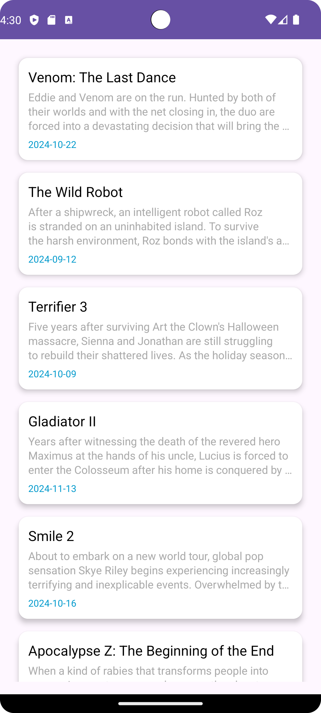

# **NowPayTask**

This is a sample Android project built using **Hilt**, **RecyclerView**, **ViewModel**, and **Coroutines with Flow** to demonstrate an architecture following the **MVVM** pattern and using **Dependency Injection** for managing dependencies. The main goal of this project is to showcase **Automation Testing** as a critical part of the development process.

## **Project Overview**

This Android app provides a login screen where users can input their email and password. Upon successful login, users are navigated to a movie list screen. The movie list is fetched dynamically from a remote API and displayed in a `RecyclerView` using data provided by a `ViewModel`.

While the core functionality includes the login flow and displaying the movie list, the main focus of this project is on **Automation Testing** to ensure that the app's functionality is robust and reliable. The project features comprehensive tests to validate key workflows, including UI, unit, and integration tests, which were implemented to demonstrate the effectiveness of automated testing in an Android app.

In addition to the core functionality, I have implemented automation testing practices to ensure the app’s reliability and performance. The tests cover the following areas:

UI Testing: Automated tests for verifying the behaviour of the login screen, input validation, and navigation to the movie list screen.

These automated tests help maintain the app’s integrity during future changes and provide confidence in its functionality.

### **Key Features:**

- **Login Screen**: The user can input email and password, with proper validation and navigation to the movie list upon successful login.
- **Movie List Screen**: Displays a list of movies fetched from a remote API.
- **ViewModel and StateFlow**: Data fetching and UI updates are handled reactively using ViewModel and StateFlow.
- **Hilt Dependency Injection**: Simplifies dependency management across the app.
- **Automation Testing**: Automated unit and UI tests are implemented using Espresso, JUnit, and Hilt.

---

## **Tech Stack**

- **Kotlin**: The language used for development.
- **Hilt**: Dependency Injection for managing and injecting dependencies.
- **Coroutines with Flow**: For managing reactive UI states.
- **ViewModel**: For managing UI-related data lifecycle-aware.
- **Espresso**: For writing UI tests.

---

## **Architecture**

This project follows the **MVVM** (Model-View-ViewModel) architecture pattern, ensuring separation of concerns and making the app easier to maintain and test:

- **Model**: Represents the data layer. The `MovieModel` holds movie-related data.
- **View**: The UI layer (activities and fragments, such as `LoginActivity` and `MovieListActivity`).
- **ViewModel**: Manages UI-related data and business logic (e.g., `MoviesViewModel`).

---

## **Automation Testing**

As the core focus of this project, **Automation Testing** ensures the app's reliability and robustness. I have implemented various types of automated tests to validate functionality and UI behaviour:

- **UI Testing**: Automated UI tests using **Espresso** to simulate user interactions, such as entering login credentials and verifying successful login navigation. Additionally, UI tests validate the correct rendering of the movie list and ensure smooth navigation between screens.
  
- **Espresso**: Espresso is used for UI testing to ensure that UI elements function as expected, including login validation, screen navigation, and the correct display of the movie list.

### **Key Automation Testing Components:**

- **Espresso** tests cover login functionality, input validation, and movie list rendering.

---

## Screenshot

|
|

---

## **Directory Structure**

Here is the directory structure for this project:

|

---

## **Package Breakdown**

- **`app/`**: The main application module, is responsible for setting up the application and initializing Hilt.
  - **`NowPayApp`**: The application class that is annotated with `@HiltAndroidApp` to enable dependency injection using Hilt.

- **`presentation/`**: Contains all the UI-related components.
  - **`ui/`**: Houses the UI classes (activities, adapters, and ViewHolders).
    - **`LoginActivity`**: The activity responsible for the login screen where users enter email and password.
    - **`MovieListActivity`**: The activity responsible for displaying the movie list after login.
    - **`MoviesAdapter`**: The adapter used to bind the movie data to the `RecyclerView`.
    - **`MovieViewHolder`**: The ViewHolder for each item in the `RecyclerView`.
  - **`MoviesViewModel`**: The ViewModel is responsible for managing UI-related data, such as fetching the list of movies.

- **`domain/`**: Contains domain-related logic and models.
  - **`MovieModel`**: A domain model representing the movie data used in the application.

- **`data/`**: The data layer, is responsible for handling data management, dependency injection, and interacting with remote data sources.
  - **`di/`**: Contains the Hilt dependency injection modules.
    - **`MoviesModule`**: A module that provides dependencies related to movie functionality.
    - **`NetworkModule`**: A module that provides network-related dependencies, such as the API client.
  - **`remote/`**: The remote data source for fetching movie data from an API.
    - **`MoviesApi`**: The interface for making network requests related to movies.
    - **`MoviesResponseModel`**: The model that maps the response from the `MoviesApi`.
    - **`MoviesRepository`**: The repository that fetches data from the remote source and provides it to the ViewModel.

---

## **How It Works**

### 1. **Login Screen**:
   - The `LoginActivity` presents the user with email and password input fields. On successful login, the user is navigated to the movie list screen.
   - The login logic is handled by the `MoviesViewModel`, which is tested to ensure correct validation and navigation behaviour.

### 2. **Movie List Screen**:
   - The `MovieListActivity` displays a list of movies, fetched from the remote API via the `MoviesViewModel`.
   - The movie list is populated using a `RecyclerView` and is observed for updates using `StateFlow` to reactively update the UI.
   - The movie-fetching logic is tested to ensure the correct data is loaded into the UI and displayed.

### 3. **Dependency Injection**:
   - Hilt manages dependencies across the app, including providing network clients, repositories, and ViewModels.
   - The app uses **MoviesModule** and **NetworkModule** to inject required dependencies like the `MoviesRepository` and API clients, ensuring a clean and modular architecture.
   - All dependencies are tested to ensure that they are injected and used correctly.

### 4. **Flow and State Management**:
   - The `MoviesViewModel` uses **StateFlow** to manage and observe the movie list, ensuring that the UI is always up-to-date.
   - Automated tests ensure that the ViewModel responds correctly to changes in state and that the UI reacts accordingly.

### 5. **UI Testing**:
   - The project includes extensive **Espresso** tests for validating the login process, input validation, and movie list rendering.
   - These tests simulate user actions, verify that UI elements respond correctly, and check that the user is navigated to the correct screen after a successful login.

### 6. **Network and Data Flow**:
   - The `MoviesApi` defines the endpoints for fetching movie data, and the `MoviesRepository` class manages interactions with the API.
   - The project’s **MockWebServer** setup allows for simulated network responses, ensuring that the app's data handling and API interactions are properly tested under different network conditions.

---

## **Acknowledgements**

- **Hilt**: For easy and efficient Dependency Injection.
- **StateFlow**: For reactively managing UI-related state.
- **RecyclerView**: For rendering the movie list in a performant manner.
- **Espresso**: For automating UI testing.
